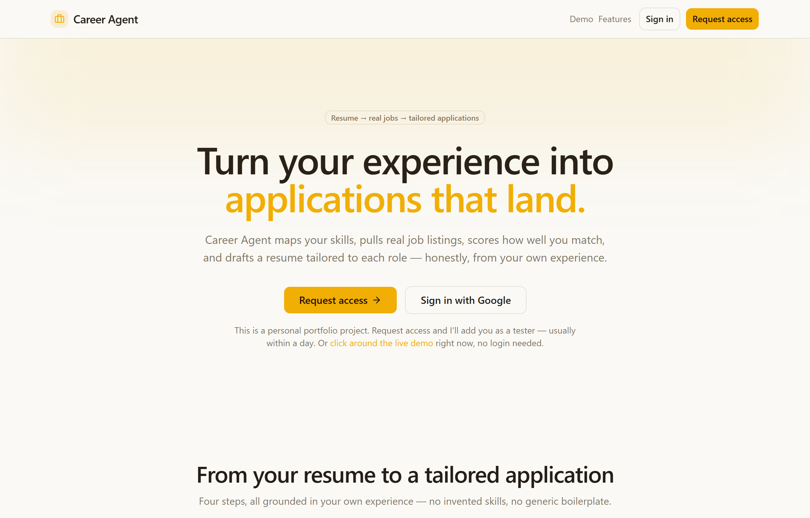

# Career Agent

**Turn your real experience into job applications that land.** Upload your resume, get role ideas drawn from your own profile, search live listings, see an honest match score for any role, track the ones you want in a pipeline, and generate a resume tailored to each job — exported as a clean, ATS-friendly PDF. All from your own data, with AI doing the heavy lifting.

<p>
  
  
  
  
  
</p>

> A full-stack AI product I built end to end — auth, database, a structured-output LLM pipeline, a third-party job API, and PDF generation — not a wrapper around a single prompt.

<p align="center">
  
</p>

---

## What it does

```
Upload resume  →  Get role ideas  →  Search & score  →  Save & track  →  Tailor & export PDF
```

1. **Upload** a `.pdf` or `.docx`. AI reads it into a structured profile — experience, skills, education, and an *interests & achievements* section that captures the signal-bearing extracurriculars (endurance sport, competitions, open-source, leadership) most parsers throw away — which you review and edit.
2. **Get role ideas** — from your profile, the app suggests concrete job titles to search for, each with a one-line rationale. One tap runs the search (no more staring at an empty box).
3. **Search & score** — pull real, current listings by role and location (Adzuna API); for any listing, AI returns an honest match percentage with your concrete strengths, gaps, and the keywords that matter.
4. **Save & track** — save roles into a pipeline and move them through *interested → drafted → applied → interviewing → closed*, with each card's match analysis kept alongside it.
5. **Tailor & export** — one click reorders and rephrases *your real experience* to foreground what the job wants (it never invents anything), then exports a single-column, ATS-friendly PDF named `LastName_Company_Role.pdf`. Past uploads and tailored drafts stay accessible from your dashboard.

Every account is fully isolated — your data is only ever visible to you (enforced at the database level with Row-Level Security).

## Highlights

- **Structured-output AI pipeline** — four Claude touchpoints (parse, suggest roles, match, tailor), each constrained to a strict JSON Schema via tool-use, so responses are always valid and never free-form text to babysit.
- **Honest by design** — the match score is calibrated, not flattering; role suggestions are grounded only in what your profile supports; and the resume tailoring is built so it *cannot* fabricate experience you don't have.
- **Captures the whole candidate** — a dedicated interests/achievements section so standout extracurriculars aren't silently dropped, then weighed as supporting evidence in matching and kept (role-aware) in the tailored draft.
- **A real pipeline** — save roles, change their status, keep each role's match analysis with the card, and re-download past resumes and tailored drafts from one place.
- **Real data, sanctioned sources** — live listings from the Adzuna API, no scraping.
- **Caching where it counts** — match results are cached per `(profile version, job)` so re-opening a role is instant and free, and the UI only offers a re-score once your profile actually changes.
- **Production-shaped** — Google OAuth, per-user RLS, private file storage, server-side secrets, typed end to end.

## Tech stack

| Layer | Choice |
|---|---|
| Framework | Next.js 14 (App Router) + TypeScript |
| UI | Tailwind CSS + Radix-style primitives on `@base-ui/react`, TanStack Query |
| Auth & data | Supabase — Google OAuth, Postgres (Row-Level Security), private Storage |
| AI | Claude API (Anthropic SDK) — one server-side model, structured output via tool-use |
| Jobs | Adzuna REST API |
| Documents | `@react-pdf/renderer` (export) · `pdf-parse` / `mammoth` (resume extraction) |
| Hosting | Vercel |

## How it works (at a glance)

```
Browser ──▶ Next.js route handlers ──▶ Supabase (Auth · Postgres · Storage)
                     │
                     ├─▶ Claude API    (parse résumé · score match · tailor draft)
                     └─▶ Adzuna API    (live job listings)
```

All AI and third-party calls run server-side; secrets never reach the browser. For the full technical write-up — the AI pipeline, parsing, match-scoring, caching, and data model — see **[docs/ARCHITECTURE.md](docs/ARCHITECTURE.md)**.

## Run it locally

```bash
npm install
cp .env.example .env.local   # then fill in the values below
npm run dev                  # http://localhost:3000
```

You'll need keys for:
- **Supabase** — `NEXT_PUBLIC_SUPABASE_URL`, `NEXT_PUBLIC_SUPABASE_ANON_KEY`, `SUPABASE_SERVICE_ROLE_KEY`
- **Anthropic** — `ANTHROPIC_API_KEY` (and optionally `ANTHROPIC_MODEL`; defaults to `claude-sonnet-4-6`, set `claude-haiku-4-5` for cheap testing)
- **Adzuna** — `ADZUNA_APP_ID`, `ADZUNA_APP_KEY` (free developer tier)
- **Resend** *(optional)* — `RESEND_API_KEY` to get notified of landing-page access requests; without it, requests still persist to the database.

Then apply the migrations in `supabase/migrations/` — `0001_init.sql` (tables, RLS policies, the private `resumes` bucket) and `0002_access_requests.sql` (the landing-page access-request table) — enable Google as an auth provider, and add `http://localhost:3000/auth/callback` to the Supabase auth redirect allow-list.

## Documentation

- **[docs/ARCHITECTURE.md](docs/ARCHITECTURE.md)** — how it's built: the AI pipeline, parsing, scoring, data model, security.
- **[PRD.md](PRD.md)** — the product spec and the decisions behind it.

## Status

A complete, working product. The full flow runs end to end — upload → review → suggest → search → score → save & track → tailor → export — fronted by a public landing page with a clickable live demo and a request-access flow. Built as a portfolio project and as a tool for my own job search. Matching is LLM-only and resumes are English-only for now.

---

Built by **Lucas Ruiz**.
