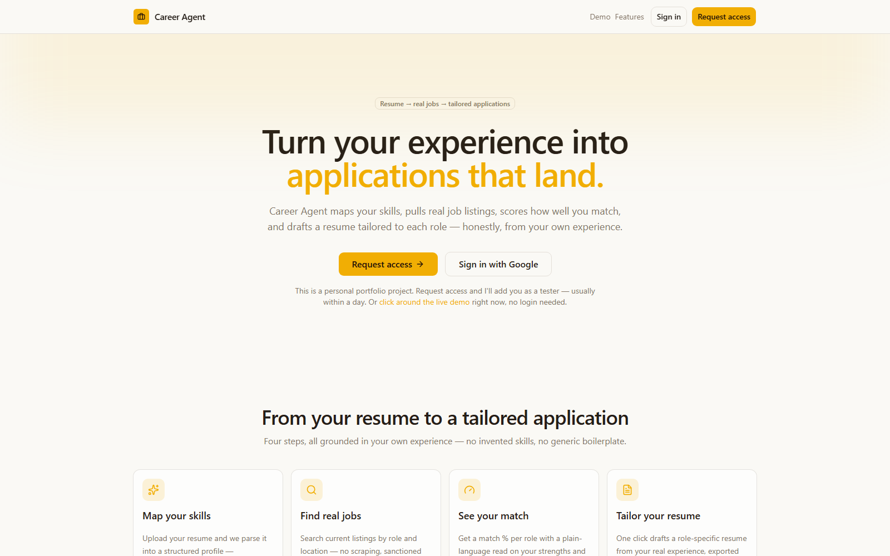

<div align="center">


# Career Agent

**Turn your real experience into job applications that land.**

[](https://nextjs.org)
[](https://www.typescriptlang.org)
[](https://supabase.com)
[](https://www.anthropic.com)
[](https://developer.adzuna.com)
[](https://vercel.com)

### [▶ Live demo →](https://career.qori.land)

</div>

<p align="center">
  
</p>

---

Career Agent turns your résumé into job applications. Upload it, get role ideas drawn from your own
profile, search live listings, see an honest match score for any role, track the ones you want in a
pipeline, and generate a résumé tailored to each job — exported as a clean, ATS-friendly PDF. A
full-stack AI product built end to end: auth, database, a structured-output LLM pipeline, a
third-party job API, and PDF generation — not a wrapper around a single prompt.

> **Try it without an account:** the [live demo](https://career.qori.land) runs the real interface on
> sample data across profile, jobs, match, and tailored résumé.

## What it does

```
Upload résumé  →  Get role ideas  →  Search & score  →  Save & track  →  Tailor & export PDF
```

1. **Upload** a `.pdf` or `.docx`. AI reads it into a structured profile — experience, skills,
   education, and an *interests & achievements* section that captures the signal-bearing
   extracurriculars most parsers throw away — which you review and edit.
2. **Get role ideas** — from your profile, the app suggests concrete job titles, each with a one-line
   rationale. One tap runs the search.
3. **Search & score** — pull real, current listings by role and location (Adzuna API); for any
   listing, AI returns an honest match percentage with your concrete strengths, gaps, and keywords.
4. **Save & track** — save roles into a pipeline and move them through *interested → drafted → applied
   → interviewing → closed*, each card keeping its match analysis.
5. **Tailor & export** — one click reorders and rephrases *your real experience* to foreground what
   the job wants (it never invents anything), then exports a single-column, ATS-friendly PDF.

Every account is fully isolated — your data is only ever visible to you, enforced at the database
level with Row-Level Security.

## Highlights

- **Structured-output AI pipeline** — four Claude touchpoints (parse, suggest, match, tailor), each
  constrained to a strict JSON Schema via tool-use, so responses are always valid.
- **Honest by design** — the match score is calibrated, not flattering; suggestions are grounded only
  in what your profile supports; tailoring *cannot* fabricate experience you don't have.
- **Captures the whole candidate** — a dedicated interests/achievements section so standout
  extracurriculars aren't silently dropped.
- **A real pipeline** — save roles, change status, keep each role's match analysis with the card, and
  re-download past résumés and drafts from one place.
- **Real data, sanctioned sources** — live listings from the Adzuna API, no scraping.
- **Caching where it counts** — match results are cached per `(profile version, job)`, so re-opening
  a role is instant and free.
- **Production-shaped** — Google OAuth, per-user RLS, private file storage, server-side secrets,
  typed end to end.

## Tech stack

| Layer | Choice |
|---|---|
| Framework | Next.js 14 (App Router) + TypeScript |
| UI | Tailwind CSS + `@base-ui/react` primitives, TanStack Query |
| Auth & data | Supabase — Google OAuth, Postgres (RLS), private Storage |
| AI | Claude API (Anthropic SDK) — structured output via tool-use |
| Jobs | Adzuna REST API |
| Documents | `@react-pdf/renderer` · `pdf-parse` / `mammoth` |
| Hosting | Vercel |

## Run it locally

```bash
npm install
cp .env.example .env.local   # fill in the values below
npm run dev                  # http://localhost:3000
```

Keys you'll need: **Supabase** (`NEXT_PUBLIC_SUPABASE_URL`, `NEXT_PUBLIC_SUPABASE_ANON_KEY`,
`SUPABASE_SERVICE_ROLE_KEY`), **Anthropic** (`ANTHROPIC_API_KEY`, optional `ANTHROPIC_MODEL`),
**Adzuna** (`ADZUNA_APP_ID`, `ADZUNA_APP_KEY`, free tier), and optional **Resend** (`RESEND_API_KEY`)
for access-request notifications. Then apply the migrations in `supabase/migrations/`, enable Google
as an auth provider, and add `http://localhost:3000/auth/callback` to the Supabase redirect allow-list.

## Roadmap

- Multilingual résumé parsing and tailoring
- One-click cover-letter drafting from the same profile
- Pipeline analytics — application velocity, response rates, stage funnels
- Embeddings pre-filter to rank large result sets before AI scoring

## Docs

- **[docs/ARCHITECTURE.md](docs/ARCHITECTURE.md)** — the AI pipeline, parsing, scoring, data model, security.
- **[PRD.md](PRD.md)** — the product spec and the decisions behind it.

---

Part of **[Qori](https://qori.land)** · built by **Lucas Ruiz**
